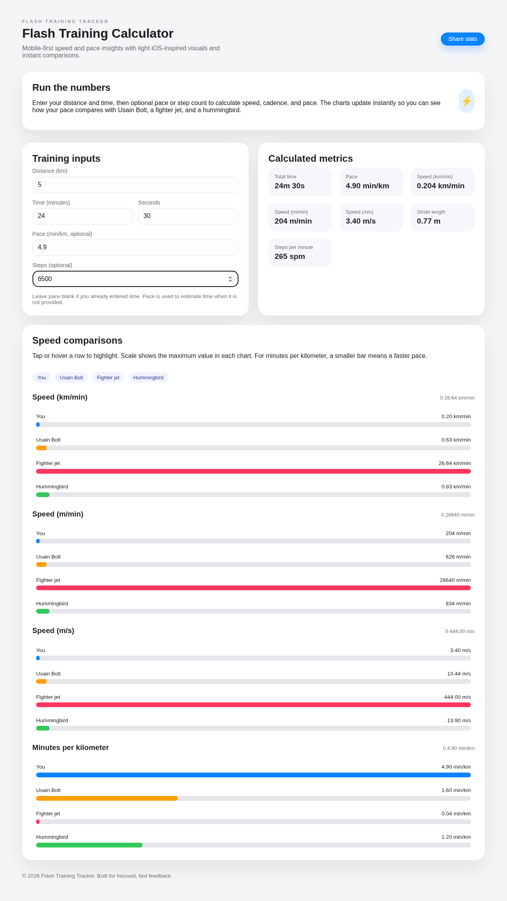
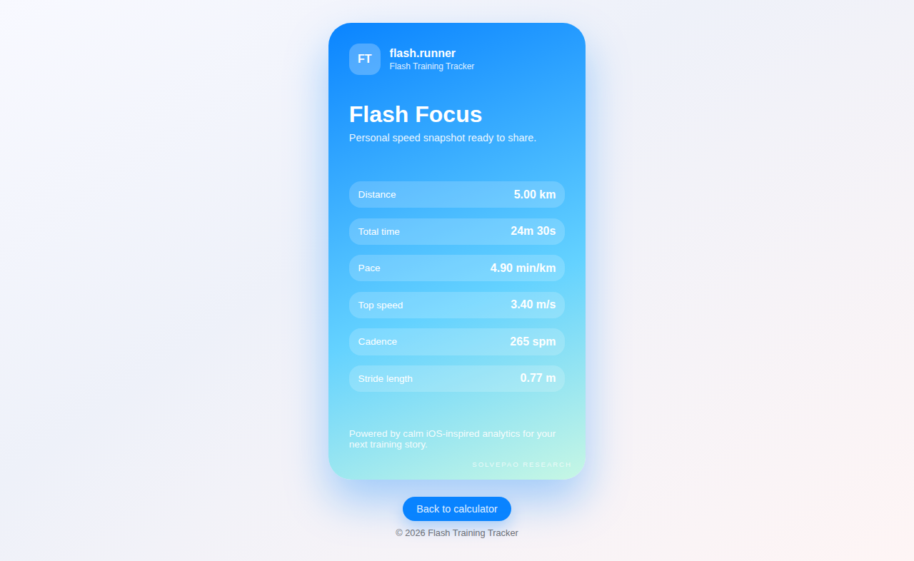

# Flash-Training-Tracker

Flash Training Tracker is a lightweight, mobile-first web experience that turns distance and time inputs into
speed, pace, and cadence insights. The UI follows an Apple iOS light theme and layers interactive comparison
charts with a shareable Instagram-story style stats card.

## Features

- Flash training calculator with distance, time, optional pace, and step count inputs.
- Automatic speed outputs (km/min, m/min, m/s) plus minutes per kilometer.
- Interactive comparison charts for Usain Bolt, a fighter jet, and a hummingbird.
- Share-ready stats page inspired by Strava/Health app visuals.
- Local storage sync so your latest calculation appears on the share card.

## Screenshots

| Calculator | Share Card |
| --- | --- |
|  |  |

## Setup

No build step is required. Open the static files directly in your browser:

```bash
open index.html
```

## Usage

1. Enter your distance and time.
2. Optionally add pace (min/km) or total steps to refine the stats.
3. Review the calculated speed metrics and comparison charts.
4. Tap **Share stats** to see the Instagram-story style card.

## Contributing

1. Fork the repository.
2. Create a feature branch: `git checkout -b feature/your-feature`.
3. Commit your changes with clear messages.
4. Open a pull request describing what you updated.

## License

[MIT](LICENSE)
